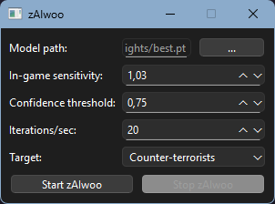

# zAIwoo

An AI-based aimbot for CS:GO.

(Click on the image to watch a small demo)

[](https://www.youtube.com/watch?v=HiWj4NeMS1E)

## Warning

Since this is nothing less than a cheat, I don't provide the AI model used to make zAIwoo work to avoid people using it in multiplayer games.

## How to install/run

- Download and install [Visual Studio 2022](https://visualstudio.microsoft.com/) (Be sure to check the "desktop development with C++" module)
- Download and install [Python](https://www.python.org/)
- Download and install [CUDA](https://developer.nvidia.com/cuda-toolkit)
- Download and install [cuDNN](https://developer.nvidia.com/cudnn)
- Clone this repository and open a terminal inside it
- Create a virtual environment:

    ```powershell
    py -m venv venv
    ```

- Load the virtual environment:

    ```powershell
    .\venv\Scripts\activate
    ```

- Download a CUDA-compatible PyTorch:

    ```powershell
    py -m pip install torch torchvision torchaudio --index-url https://download.pytorch.org/whl/cu128
    ```

- Install the dependencies:

    ```powershell
    py -m pip install -r requirements.txt
    ```

- Run the program:

    ```powershell
    py -m zaiwoo
    ```

    You will be greeted by the following UI:

    

    Configure the options as you wish then click on "Start zAIwoo".

## Known issues

- zAIwoo doesn't work with scoped weapons such as AWP, AUG, etc. This will NOT be addressed.
- zAI doesn't work when CS:GO is in fullscreen mode. Be sure to played in windowed mode or in fullscreen windowed mode.
- The mouse doesn't move: if you are running CS:GO as administrator (like the crack I have) then you need to start zAIwoo as administrator as well.
